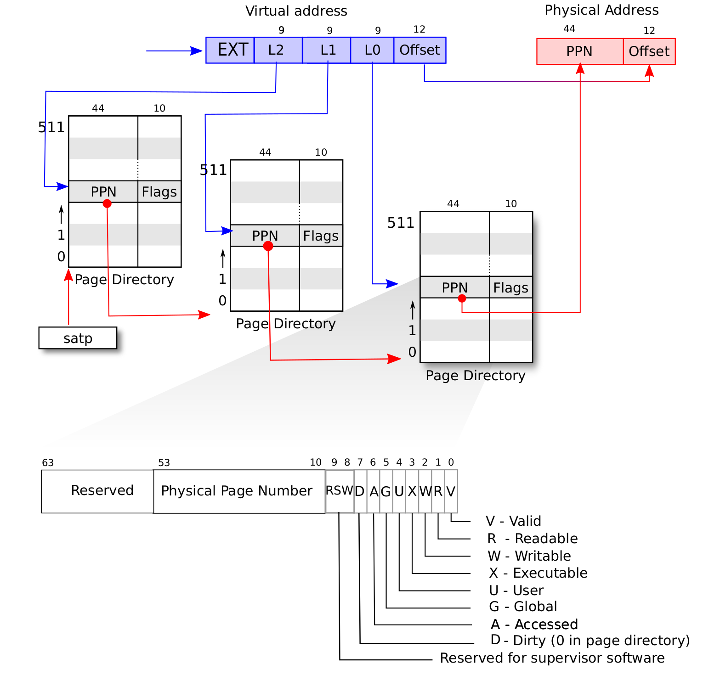

# 内存页表

页表项结构(RISC-V Sv39):
```
 63           54 53        28 27        19 18        10 9         0
+---------------+------------+------------+------------+-----------+
|    Reserved   |    PPN[2] |    PPN[1] |    PPN[0] |   Flags  |
+---------------+------------+------------+------------+-----------+
```


## 名词

- 页表 `typedef uint64 *pagetable_t;`：地址转换的核心任务在于如何维护虚拟页号到物理页号的**映射**。用于构建多级页表结构。
    - 是一个指针,指向512个连续的**PTE数组**。一个页表占用一个4KB页面。
- 页表项 (PTE, Page Table Entry) `typedef uint64 pte_t`：物理页号和全部的**标志位**以某种固定的格式保存在一个结构体中，是利用**虚拟页号**在页表中查到的结果。
    - 存储单个页面（4k）映射信息
    - 包含物理页号(PPN)和权限标志位
- 页目录项(Page Directory Entry) `typedef uint64 pde_t;`
    - 本质上与PTE相同，指向下一级页表的物理地址，在RISC-V中PDE和PTE使用相同的格式。

```
页表目录 -> 页表 -> 页表项 -> 物理页面
(L2)      (L1)    (L0)      (Physical Page)
```

## 变量

- trampoline：用户的虚拟地址起始位置

## 函数

- bin_loader：为每个进程的pg分配一张页表的空间，分配好了进程的页表后再把trap（4k）和ustack（4k）映射（mappages）到页表pg。

- 页表实现va–>pa的转换过程
    - `vm.c`的`walk`模拟CPU进行MMU的过程。输入**页表**和**待转换的虚拟地址**，通过SV39的转换返回了 页表项 (PTE, Page Table Entry) 。
    - `vm.c`的`walk_addr`函数根据用户的虚拟地址和页表项，找到对应的物理地址。它不包含虚拟地址里用到的偏置项，如果需要偏置优先采用`user_addr`。
- 页表的建立过程

- 启用页表后的跨页表操作：用户态和内核态的内存拷贝